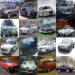
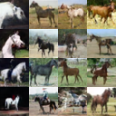
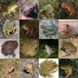
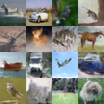

# rectified-flow

Rectified flow (flow matching) image generation on CIFAR-10 with a small UNet
(FiLM time conditioning), trained from scratch. Euler and Heun samplers, EMA
weights, and classifier-free guidance in the class-conditional version.

- `tinygrad/main.py` — original tinygrad implementation.
- `pytorch/torch_same_model.py` — direct PyTorch port of the same model
  (faster to train on NVIDIA).
- `pytorch/torch_cifar_rf.py` — bigger class-conditional PyTorch version with
  classifier-free guidance; source of the samples below.

CIFAR-10 downloads automatically (tinygrad datasets / torchvision). Checkpoints
are gitignored — retrain to reproduce.

## Samples

Class-conditional samples at 20k steps, guidance 1.5 (EMA weights, Heun):

| automobile | horse | frog |
|---|---|---|
|  |  |  |

Mixed-class grid: 

All ten class grids are in [pytorch/](pytorch/), plus sample outputs from the
same-model PyTorch run (`torch_same64_b512_10100_ema.png`) and the tinygrad run
(`tinygrad/cook32_10100_ema.png`).
